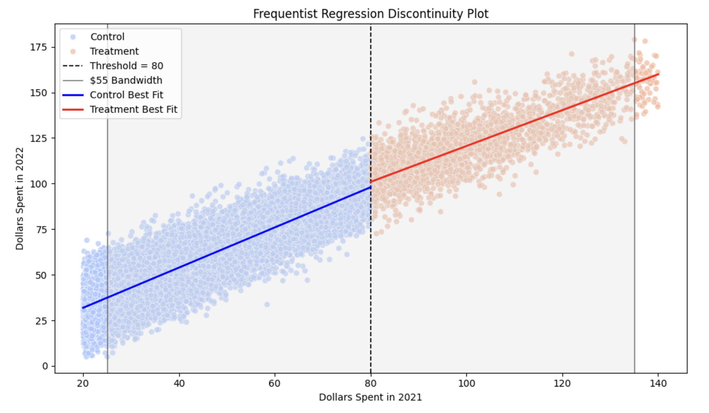
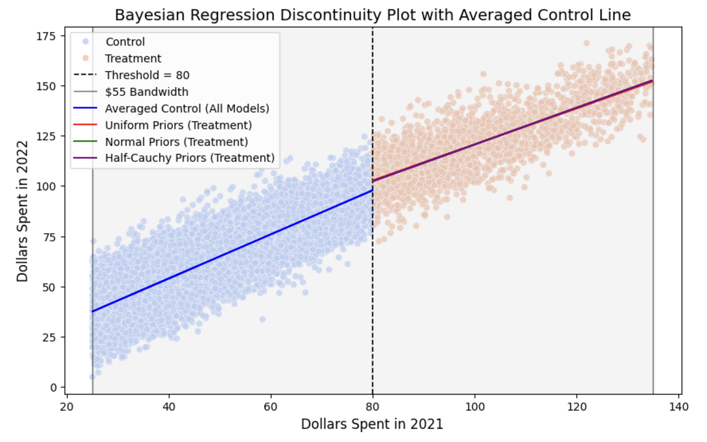

<h1 align="center">Unwrapping Customer Delight</h1>

Break Through Tech: AI Studio Project

Unwrapping Customer Delight: Using Frequentist and Bayesian Regression Models to Optimize Surprise Gift Strategies

<h2>Overview</h2>

This project analyzes the impact of surprise gifts on customer spending using Regression Discontinuity Design (RDD) models. Both Frequentist and Bayesian approaches are employed to evaluate the treatment effect at the $80 spending threshold. The analysis provides insights into customer behavior and the effectiveness of gift-based interventions.

  
  

<h3>Objectives</h3>
<ul>
  <li>Evaluate the treatment effect at the $80 cutoff using Frequentist and Bayesian RDD models.</li>
  <li>Compare the robustness and reliability of the models in explaining customer behavior.</li>
  <li>Frequentist RDD Analysis</li>
  <li>Provide actionable insights into optimizing gift-based marketing strategies.</li>
</ul>

<h3>Key Features and Methodology </h3>
<ul>
  <li>Exploratory Data Analysis (EDA)</li>
  <li>Bandwidth Selection Analysis</li>
  <li>Frequentist RDD Analysis</li>
  <li>Bayesian RDD Analysis</li>
</ul>

<h3>Individual Contributions</h3>
<ul>
  <li> EDA: <a href="https://github.com/s-bhatia1216">Sonal</a>, <a href="https://github.com/emilyp6">Emily</a></li>
  <li> Frequentist Model, Frequentist Analysis: <a href="https://github.com/edenhandom">Eden</a>, <a href="https://github.com/zzaneer086">Zainab</a></li>
  <li> Bayesian Model, Bayesian Analysis: <a href="https://github.com/edenhandom">Eden</a>, <a href="https://github.com/s-bhatia1216">Sonal</a></li>
  <li> Bandwidth Selection and Analysis: <a href="https://github.com/emilyp6">Emily</a>, <a href="https://github.com/zzaneer086">Zainab</a></li>
  <li> Comparison Between Models: <a href="https://github.com/s-bhatia1216">Sonal</a>, <a href="https://github.com/zzaneer086">Zainab</a></li>
</ul>

<h2>Quickstart</h2>

Launch in Colab.

<h2>License</h2>

This project is licensed under the Apache License 2.0. See the LICENSE file for more details.

<h2>Acknowledgments</h2>

This project was completed as part of a challenge project with The Estée Lauder Companies. Special thanks to all involved for their guidance.

